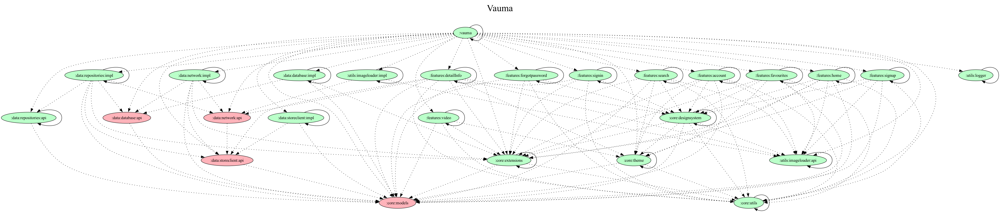

# VaumaPreview

## Project modules dependency


## Project tech stack 
- ui: Jetpack Compose
- network: Ktor
- bd: sqldelight
- paging: custom realization
- navigation: decompose
- ui pattern: mvi, with MVIKotlin realization
- image loading: coil
- build tasks: build-logic module with custom gradle plugins
- di: kotlin inject
- tests: junit4, mockk, turbine, kaspresso
- clean arch

## Description 
This is mobile app for watching anime
Project use own server 
All resources are hiden behind auth(jwt tokens)

## Plans
- write tests in feature modules
- migrate to kmm

## Code samples

### PagingController (now modifiing)

```
@Inject
internal class PagingController(
    val pagingRequest: suspend (Long) -> List<PagingAnimeInfo>,
    val lastNodeInDb: suspend () -> LastDbNode,
    val getAnimeListByPage: suspend (Long) -> List<PagingAnimeInfo>,
    val cashSuccessNetworkResult: suspend (List<PagingAnimeInfo>, Long, Boolean) -> Unit,
    val currentTime: Long
) {

    private var page = INITIAL_PAGE
    private var endOfPaginationReached = false

    private val resultList = mutableListOf<AnimeInfo>()

    private val _pagingState = MutableStateFlow(PagingState(emptyList(), LoadState.EMPTY))
    private val pagingState = _pagingState.asStateFlow()

    val flow: Flow<PagingState> = pagingState

    suspend fun loadNextPage() {
        if (page == INITIAL_PAGE || !endOfPaginationReached && _pagingState.value.loadState == LoadState.REQUEST_INACTIVE) {
            _pagingState.update {
                if (page == INITIAL_PAGE) _pagingState.value.copy(loadState = LoadState.REFRESH_LOADING)
                else _pagingState.value.copy(loadState = LoadState.APPEND_LOADING)
            }
        }

        try {
            val cacheTimeout = TimeUnit.MILLISECONDS.convert(TWELVE_HOURS, TimeUnit.HOURS)
            val lastDbNode = lastNodeInDb()

            val data =
                if (currentTime - lastDbNode.createAt >= cacheTimeout || page > lastDbNode.page) {
                    val networkResults = pagingRequest(page)
                    cashSuccessNetworkResult(
                        networkResults,
                        page,
                        networkResults.last().isLast
                    )
                    Pair(
                        networkResults.map { it.toAnimeInfo() },
                        networkResults.last().isLast
                    )
                } else {
                    val response = getAnimeListByPage(page)
                    val lastItem = response.last()
                    Pair(response.map { it.toAnimeInfo() }, lastItem.isLast)
                }

            val list = data.first
            val isLast = data.second

            endOfPaginationReached = isLast

            if (page == INITIAL_PAGE) {
                if (list.isEmpty()) {
                    _pagingState.update { _pagingState.value.copy(loadState = LoadState.EMPTY) }
                    return
                }
                resultList.clear()
                resultList.addAll(list)
            } else {
                resultList.addAll(list)
            }

            _pagingState.update {
                _pagingState.value.copy(
                    list = resultList.toList(),
                    loadState = LoadState.REQUEST_INACTIVE
                )
            }

            if (!endOfPaginationReached) {
                page++
            }

            if (endOfPaginationReached) {
                _pagingState.update { _pagingState.value.copy(loadState = LoadState.REACH_END) }
            }
        } catch (e: Exception) {
            _pagingState.update {
                if (page == INITIAL_PAGE) _pagingState.value.copy(loadState = LoadState.REFRESH_ERROR)
                else _pagingState.value.copy(loadState = LoadState.APPEND_ERROR)
            }
        }
    }

    companion object {
        private const val INITIAL_PAGE = 0L
        private const val TWELVE_HOURS = 12L
    }
}
```

### Git hooks

#### running pre commit hook with detekt check
```
#!/usr/bin/env bash
echo "*******************************"
echo   "Running git pre-commit hook"
echo "*******************************"
OUTPUT="/tmp/pre-commit-check-$(date +%s)"
./gradlew preCommitCheck > $OUTPUT
EXIT_CODE=$?
if [ $EXIT_CODE -ne 0 ]; then
  cat $OUTPUT
  rm $OUTPUT
  echo "***********************************************"
  echo " Please fix the above issues before committing "
  echo "***********************************************"
  exit $EXIT_CODE
fi
```

#### running pre push hook with all test run
```
#!/usr/bin/env bash
echo "*******************************"
echo   "Running git pre-push hook"
echo "*******************************"
OUTPUT="/tmp/pre-push-check-$(date +%s)"
./gradlew testGmsDebugUnitTest > $OUTPUT
EXIT_CODE=$?
if [ $EXIT_CODE -ne 0 ]; then
  cat $OUTPUT
  rm $OUTPUT
  echo "***********************************************"
  echo "      Please fix tests before pushing "
  echo "***********************************************"
  exit $EXIT_CODE
fi
```

### Convention plugin sample
```
class AndroidLibraryConventionPlugin : Plugin<Project> {
    override fun apply(project: Project) {
        with(project) {
            with(pluginManager) {
                apply("com.android.library")
                apply("org.jetbrains.kotlin.android")
            }

            extensions.configure<LibraryExtension> {
                configureKotlinAndroid(this)
            }

            dependencies {
                add("implementation", libs.findLibrary("core-ktx").get())
            }
        }
    }

    private fun Project.configureKotlinAndroid(
        commonExtension: CommonExtension<*, *, *, *, *>,
    ) {
        commonExtension.apply {
            compileSdk = COMPILE_SDK

            defaultConfig {
                minSdk = MIN_SDK
            }

            compileOptions {
                sourceCompatibility = JavaVersion.VERSION_17
                targetCompatibility = JavaVersion.VERSION_17
            }
        }

        configureKotlin()
    }

    private fun Project.configureKotlin() {
        tasks.withType<KotlinCompile>().configureEach {
            kotlinOptions {
                jvmTarget = JavaVersion.VERSION_17.toString()
            }
        }
    }

    companion object {
        private const val MIN_SDK = 24
        private const val COMPILE_SDK = 34
    }
}
```

### Image loader with interceptror 
```
@Inject
class VaumaImageLoaderImpl(
    private val context: Context,
    private val appNetworkClient: com.miraeldev.api.AppNetworkClient
) : VaumaImageLoader {
    override fun load(config: ImageRequest.Builder.() -> ImageRequest.Builder): ImageRequest = ImageRequest
        .Builder(context)
        .fetcherFactory(KtorNetworkFetcherFactory(appNetworkClient.client))
        .crossfade(true)
        .config()
        .build()
}
```
